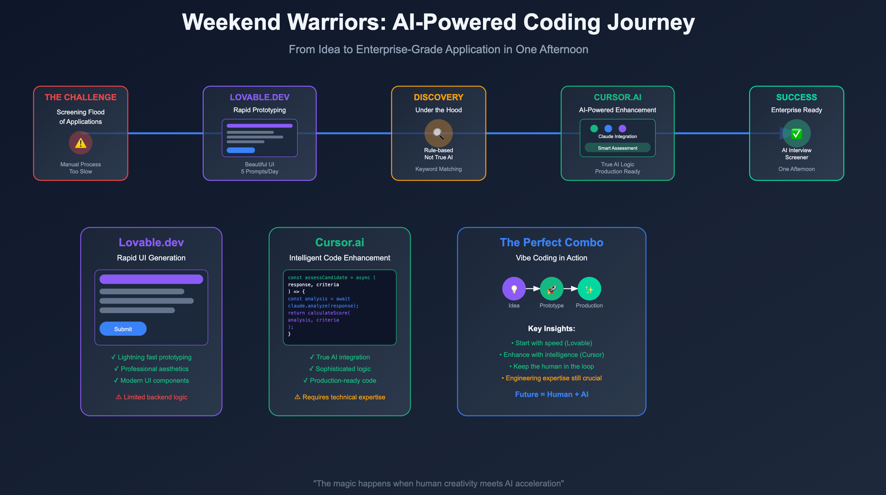

# Data Whisperer Interview Platform

An interactive interview platform that evaluates candidate responses using either rule-based evaluation or AI-powered assessment through Claude.

## Process Flow




Find the blogpost relevant to this article at: https://lnkd.in/e3CpVUVa

## Features

- Interactive interview interface
- Support for multiple roles (Data Scientist, Data Engineer, etc.)
- Two evaluation methods:
  - Rule-based deterministic evaluation
  - AI-powered evaluation using Claude
- Real-time response evaluation
- Detailed feedback and scoring
- Interview history tracking


## Tech Stack

### Frontend
- React
- TypeScript
- Vite
- Tailwind CSS

### Backend
- Node.js
- Express
- Anthropic Claude API

## Prerequisites

- Node.js (v14 or higher)
- npm or yarn
- Anthropic API key (for AI-powered evaluation)

## Installation

1. Clone the repository:
```bash
git clone https://github.com/yourusername/data-whisperer-interview.git
cd data-whisperer-interview
```

2. Install frontend dependencies:
```bash
npm install
```

3. Install backend dependencies:
```bash
cd backend
npm install
```

## Configuration

1. Set up environment variables for the backend:
```bash
# In the backend directory
export ANTHROPIC_API_KEY=your-anthropic-api-key-here
```

2. Set up environment variables for the frontend:
```bash
# In the root directory
echo "VITE_API_URL=http://localhost:3001" > .env
```

## Running the Application

1. Start the backend server:
```bash
cd backend
npm run dev
```

2. In a new terminal, start the frontend:
```bash
# In the root directory
npm run dev
```

3. Open your browser and navigate to `http://localhost:3000`

## Usage

1. Select the role for the interview (Data Scientist, Data Engineer, etc.)
2. Choose the evaluation method:
   - Rule-based: Uses predefined criteria for evaluation
   - AI-powered: Uses Claude for dynamic evaluation
3. If using AI-powered evaluation, provide your Anthropic API key when prompted
4. Start the interview and answer the questions
5. Receive real-time feedback and scoring
6. View the final evaluation and recommendations

## Project Structure

```
data-whisperer-interview/
├── src/                    # Frontend source code
│   ├── components/        # React components
│   ├── pages/            # Page components
│   ├── types/            # TypeScript type definitions
│   └── lib/              # Utility functions
├── backend/              # Backend server
│   ├── server.js        # Express server
│   └── package.json     # Backend dependencies
└── package.json         # Frontend dependencies
```

## Development

### Frontend Development
- The frontend is built with React and TypeScript
- Uses Vite for fast development and building
- Styled with Tailwind CSS

### Backend Development
- Express server handles API requests
- Integrates with Anthropic's Claude API for AI-powered evaluation
- Provides fallback to rule-based evaluation if AI evaluation fails

## Contributing

1. Fork the repository
2. Create a feature branch
3. Commit your changes
4. Push to the branch
5. Create a Pull Request

## License

This project is licensed under the MIT License - see the LICENSE file for details.
